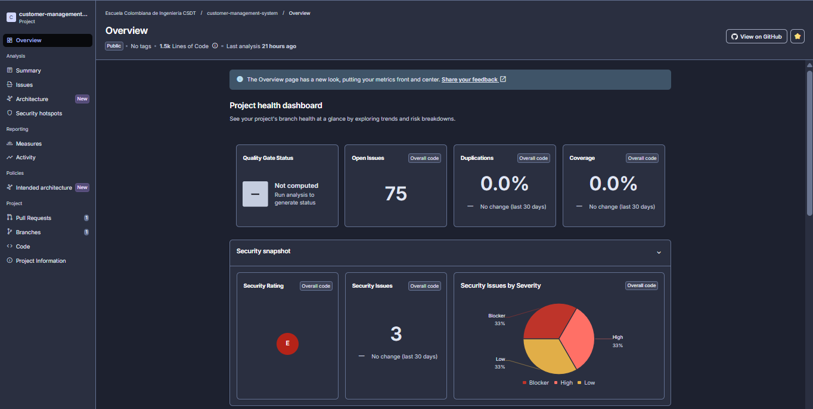
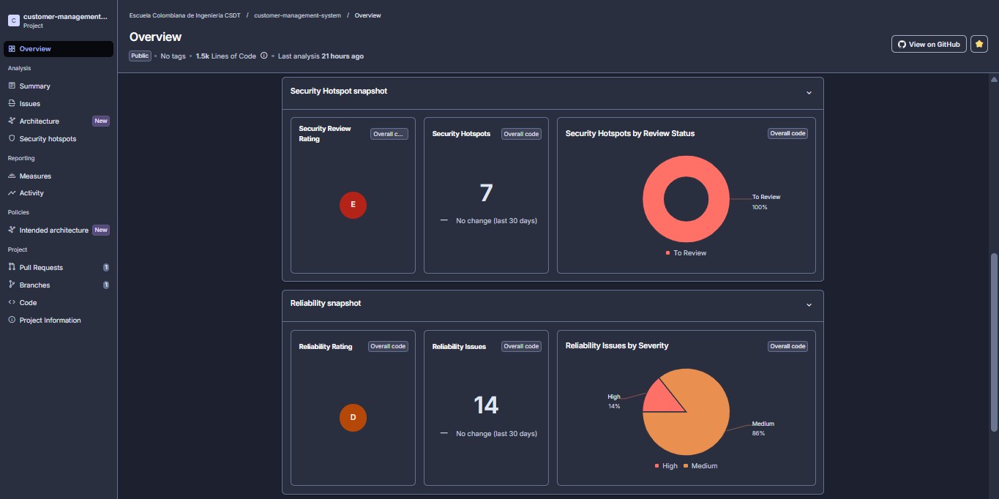
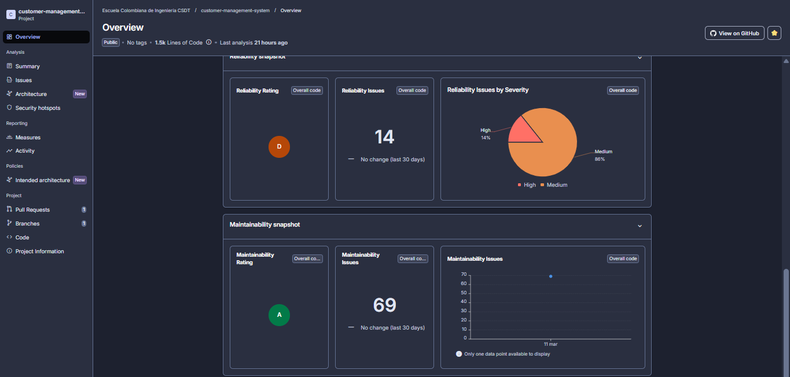
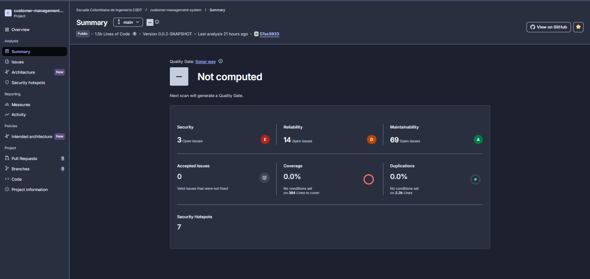
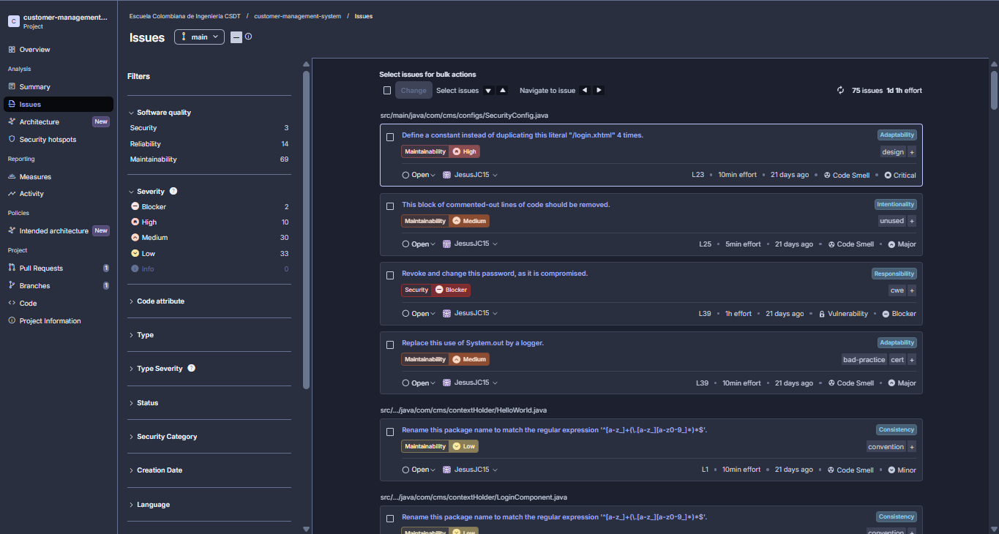
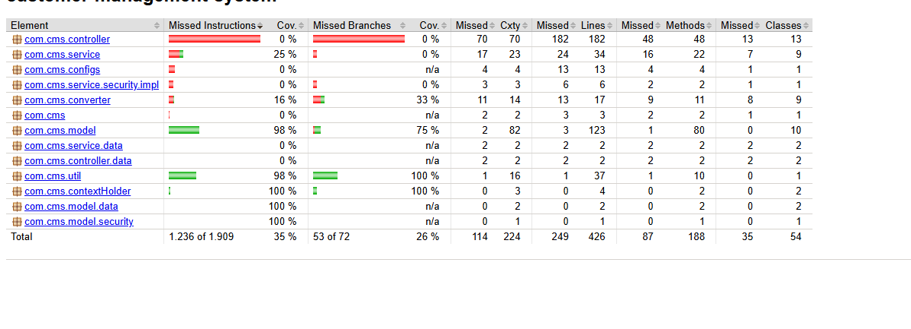
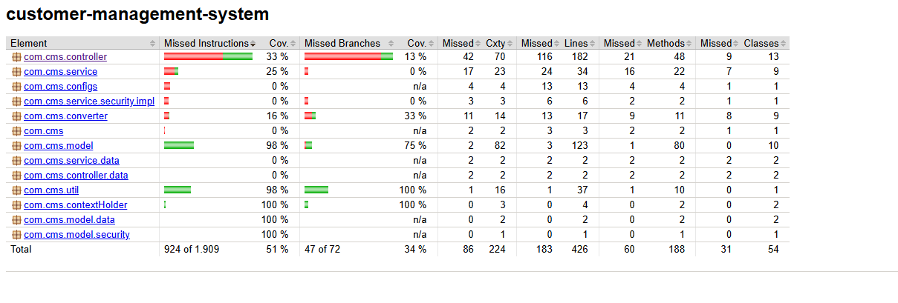

# CSDT – Primera Entrega 2026

## Modelos de calidad  
### Análisis integral del proyecto `customer-management-system` con base en SonarQube Cloud

> **Propósito del documento**  
> Este archivo interpreta técnicamente la evidencia entregada por SonarQube Cloud y la contrasta con una revisión directa del repositorio. El objetivo no es repetir el dashboard, sino traducir sus métricas a una lectura seria de calidad de software, riesgo técnico, deuda técnica y madurez del proyecto.

---

## 1. Resumen ejecutivo

El proyecto presenta una situación **mixta**: por un lado, SonarQube reporta una **mantenibilidad A** y **0.0% de duplicación**, lo cual sugiere que el código todavía es recuperable y que no existe una crisis por copia masiva de bloques. Por otro lado, el mismo análisis muestra una **seguridad E**, una **confiabilidad D**, **75 issues abiertos**, **7 security hotspots sin revisar** y **0.0% de cobertura**. Esa combinación es importante: el sistema todavía puede refactorizarse, pero hoy no es razonable afirmar que posee una calidad integral aceptable.

La lectura técnica más honesta es esta: la mayor amenaza del proyecto no es la cantidad bruta de issues, sino su **concentración en clases base**, su **impacto sobre seguridad** y la **ausencia de pruebas automáticas**. En otras palabras, el sistema no está roto por complejidad algorítmica, sino por decisiones estructurales: configuración insegura, acoplamiento fuerte en controladores y servicios, persistencia expuesta directamente al borde REST, uso de APIs heredadas y prácticas que reducen la trazabilidad operativa.

---

## 2. Enfoque de análisis: modelo de calidad aplicado

Para interpretar el resultado se toma como marco principal una lectura inspirada en **ISO/IEC 25010**, aterrizada a las dimensiones que SonarQube sí hace visibles en este proyecto:

- **Seguridad**
- **Confiabilidad**
- **Mantenibilidad**
- **Capacidad de prueba**
- **Integridad del diseño**
- **Gobernanza técnica**

Este enfoque permite evitar una mala práctica frecuente: creer que una única letra alta —por ejemplo, la A en mantenibilidad— representa la calidad total del producto. No la representa. La calidad real depende del equilibrio entre dimensiones.

---

## 3. Línea base de calidad observada

### 3.1 Estado general del tablero

| Dimensión         | Indicador   | Hallazgos   | Lectura                                                      |
|:------------------|:------------|:------------|:-------------------------------------------------------------|
| Seguridad         | E           | 3           | 1 blocker, 1 high y 1 low                                    |
| Confiabilidad     | D           | 14          | 2 high y 12 medium                                           |
| Mantenibilidad    | A           | 69          | 1 blocker, 7 high, 29 medium y 32 low                        |
| Cobertura         | 0.0%        | —           | En la línea base analizada por SonarQube no existían pruebas automatizadas en el repositorio |
| Duplicación       | 0.0%        | —           | Métrica positiva, pero insuficiente para afirmar buen diseño |
| Security Hotspots | E           | 7           | 100% pendientes de revisión según el panel                   |

### 3.2 Distribución por severidad

| Severidad   |   Cantidad | Porcentaje   |
|:------------|-----------:|:-------------|
| Blocker     |          2 | 2.7%         |
| Critical    |         10 | 13.3%        |
| Major       |         30 | 40.0%        |
| Minor       |         33 | 44.0%        |

### 3.3 Distribución por tipo de hallazgo

| Tipo          |   Cantidad | Porcentaje   |
|:--------------|-----------:|:-------------|
| Vulnerability |          3 | 4.0%         |
| Bug           |          3 | 4.0%         |
| Code Smell    |         69 | 92.0%        |

### 3.4 Lectura rápida de la línea base

- El proyecto concentra **75 issues abiertos** con un esfuerzo estimado total de **591 minutos** (cerca de **9.85 horas**) para corrección inicial.
- El **92.0%** de los hallazgos son **code smells**. Esto no significa que sean irrelevantes; significa que la mayor parte del deterioro es **estructural y de disciplina técnica**.
- Existen **3 vulnerabilidades** y **3 bugs**. Aunque son pocos en número, son más importantes que decenas de smells menores.
- La evidencia muestra **7 security hotspots** y **ninguno ha sido revisado**, por lo que la incertidumbre de seguridad sigue abierta.
- En la línea base analizada por SonarQube, la cobertura estaba en **0.0%** y el repositorio no contenía carpeta `src/test`, lo que confirmaba la ausencia de pruebas automatizadas antes de esta entrega.

---

## 4. Concentración de issues: dónde está realmente el problema

Uno de los hallazgos más relevantes no está solo en la severidad, sino en la **concentración**. El proyecto no tiene la deuda distribuida de forma homogénea: la mayor parte del problema vive en pocas clases, especialmente en clases base que afectan varias rutas del sistema.

### 4.1 Archivos con mayor concentración de hallazgos

| Archivo                                         |   Issues | Participación   |   Bloqueantes |   Críticos |   Mayores |   Menores | Esfuerzo   |
|:------------------------------------------------|---------:|:----------------|--------------:|-----------:|----------:|----------:|:-----------|
| com/cms/controller/AbstractController.java      |       21 | 28.0%           |             0 |          4 |         8 |         9 | 188 min    |
| com/cms/service/AbstractService.java            |       11 | 14.7%           |             0 |          2 |         5 |         4 | 116 min    |
| com/cms/util/RandomUtility.java                 |        7 | 9.3%            |             0 |          1 |         1 |         5 | 36 min     |
| com/cms/controller/RandomController.java        |        7 | 9.3%            |             0 |          0 |         6 |         1 | 32 min     |
| com/cms/controller/DashboardViewController.java |        6 | 8.0%            |             0 |          0 |         3 |         3 | 27 min     |
| com/cms/configs/SecurityConfig.java             |        4 | 5.3%            |             1 |          1 |         2 |         0 | 85 min     |
| com/cms/service/UnitService.java                |        3 | 4.0%            |             1 |          1 |         1 |         0 | 40 min     |
| com/cms/controller/DashboardController.java     |        3 | 4.0%            |             0 |          0 |         0 |         3 | 3 min      |

### 4.2 Lectura arquitectónica de la concentración

Los **cinco archivos más afectados** concentran **52 de los 75 issues**, es decir, cerca del **69.3%** del total. Eso es importante porque revela que la deuda técnica no está dispersa: está localizada en componentes que son estructuralmente sensibles.

Los dos puntos más delicados son:

1. **`AbstractController.java`**  
   Acumula 21 hallazgos y funciona como controlador base. Cualquier decisión débil en esta clase se replica en múltiples endpoints y flujos JSF/REST.

2. **`AbstractService.java`**  
   Acumula 11 hallazgos y sirve como base de acceso a datos y comportamiento genérico. Un error o mala práctica aquí tiene efecto transversal sobre varias entidades.

Cuando la deuda se concentra en componentes base, el riesgo es doble:  
- el problema es más profundo de lo que sugiere el número de archivos afectados;  
- pero también existe una oportunidad, porque corregir bien unas pocas clases puede mejorar gran parte del proyecto.

---

## 5. Lectura por dimensión de calidad

### 5.1 Seguridad

#### Estado
**Crítico**

#### Evidencia principal
- **Security Rating E**
- **3 security issues**
- **7 security hotspots**
- **100% de hotspots pendientes de revisión**

#### Hallazgos que explican el rating

**a) Credencial comprometida en `SecurityConfig.java`**  
En `SecurityConfig.java` existe un `main()` auxiliar que imprime el hash de la contraseña `"123"`. Sonar lo marca como vulnerabilidad blocker porque la contraseña usada es conocida como comprometida y, además, porque esa lógica no debería convivir con la configuración de seguridad.

**b) Desactivación de CSRF**  
La configuración contiene `http.csrf().disable();`. Esa decisión puede ser válida en ciertos contextos muy controlados, pero Sonar la marca como hotspot de alto interés porque abre una superficie de ataque en aplicaciones con autenticación basada en formularios.

**c) Exposición de entidad persistente en el endpoint REST**  
`MainRestController` recibe y retorna directamente `SecurityUser` en `/api/user/register`. Sonar advierte que una entidad persistente no debería exponerse como contrato externo. La razón es simple: una entidad suele traer campos, relaciones o semánticas internas que no deberían salir ni entrar sin mediación de un DTO.

**d) Registro de datos controlados por el usuario**  
En `AbstractController.java`, Sonar señala un caso de logging con datos provenientes de la petición. Aunque su severidad sea low, el patrón es incorrecto porque permite contaminar logs o introducir información maliciosa en la trazabilidad.

**e) Credenciales en texto plano**  
Fuera del JSON de Sonar, la revisión del repositorio identifica en `application.properties` usuario y contraseña de PostgreSQL en texto plano (`postgres/postgres`). Aunque Sonar no lo haya contado en el tablero como issue abierto visible, desde calidad y operación esto es una mala práctica clara.

#### Interpretación

La seguridad del proyecto falla menos por cantidad y más por **naturaleza de los hallazgos**. En software real, una sola mala decisión de seguridad puede valer más que veinte smells menores. Aquí se combinan:
- configuración sensible expuesta,
- protección CSRF deshabilitada,
- frontera REST demasiado acoplada a persistencia,
- y hotspots aún sin revisión formal.

#### Juicio técnico

**El sistema no debería considerarse listo para producción** mientras no se corrijan las vulnerabilidades abiertas, se revisen los hotspots y se retire la exposición de secretos y entidades internas.

---

### 5.2 Confiabilidad

#### Estado
**Débil**

#### Evidencia principal
- **Reliability Rating D**
- **14 reliability issues**
- Distribución reportada: **2 high** y **12 medium**

#### Hallazgos que explican el rating

**a) Reinstanciación repetitiva de `Random`**  
Tanto en `AbstractController.java` como en `RandomUtility.java`, Sonar marca como bug crítico el patrón de crear `new Random()` repetidamente. Puede parecer menor, pero es una señal de código poco robusto y potencialmente inconsistente, especialmente si la lógica evoluciona o se usa de forma intensiva.

**b) Estructuras condicionales redundantes**  
En `AbstractController.init()` la condición `if/else` ejecuta lo mismo en ambos bloques. Eso es un bug de calidad porque expresa una intención falsa: el código aparenta decidir algo distinto, pero no lo hace.

**c) Inyección por campo en controladores y servicios**  
El patrón `@Autowired` sobre campos aparece repetido en varias clases. Sonar lo asocia a mantenibilidad y confiabilidad porque dificulta la construcción explícita del objeto, complica testing e invisibiliza dependencias críticas.

**d) Sombra de campos heredados**  
`UnitService.java` redefine `entityManager`, ocultando el campo heredado desde `AbstractService`. Sonar lo marca como blocker de mantenibilidad, pero también es una señal de confiabilidad: introduce ambigüedad en el estado y abre la puerta a errores de mantenimiento difíciles de detectar.

#### Interpretación

La confiabilidad no está comprometida por algoritmos complejos, sino por **diseño frágil y disciplina insuficiente**. Hay decisiones que aumentan la probabilidad de comportamiento inesperado: herencia mal controlada, dependencias ocultas, reflexión, estado mutable y patrones repetidos sin pruebas que los contengan.

#### Juicio técnico

La nota **D** es coherente con un sistema funcional pero **frágil ante cambios**. Mientras no exista una base de pruebas, cualquier corrección importante seguirá teniendo riesgo de regresión.

---

### 5.3 Mantenibilidad

#### Estado
**Aceptable, pero engañoso si se interpreta sola**

#### Evidencia principal
- **Maintainability Rating A**
- **69 maintainability issues**
- Distribución reportada: **1 blocker, 7 high, 29 medium y 32 low**

#### ¿Por qué puede coexistir una A con 69 issues?

Porque Sonar no evalúa la mantenibilidad solo por cantidad de alerts, sino por el peso relativo de la deuda técnica sobre el tamaño del código. En este proyecto, muchos hallazgos tienen corrección rápida, por eso la letra A no contradice que haya deuda; solo indica que **todavía no es demasiado costosa de pagar**.

#### Patrones más repetidos

| Regla      | Hallazgo recurrente                                                                             |   Repeticiones | Esfuerzo   |
|:-----------|:------------------------------------------------------------------------------------------------|---------------:|:-----------|
| java:S6813 | Remove this field injection and use constructor injection instead.                              |             11 | 55 min     |
| java:S1124 | Reorder the modifiers to comply with the Java Language Specification.                           |              5 | 10 min     |
| java:S3457 | Format specifiers should be used instead of string concatenation.                               |              5 | 5 min      |
| java:S5738 | Remove this call to a deprecated method, it has been marked for removal.                        |              3 | 45 min     |
| java:S1488 | Immediately return this expression instead of assigning it to the temporary variable "tobject". |              3 | 6 min      |
| java:S4488 | Replace "@RequestMapping(method = RequestMethod.GET)" with "@GetMapping"                        |              3 | 6 min      |
| java:S1128 | Remove this unnecessary import: same package classes are always implicitly imported.            |              3 | 3 min      |
| java:S1948 | Make non-static "entityManager" transient or serializable.                                      |              2 | 60 min     |
| java:S106  | Replace this use of System.out by a logger.                                                     |              2 | 20 min     |
| java:S120  | Rename this package name to match the regular expression '^[a-z_]+(\.[a-z_][a-z0-9_]*)*$'.      |              2 | 20 min     |

#### Lectura de los patrones

Los hallazgos repetidos muestran que la deuda técnica tiene un perfil bastante claro:

- **Inyección por campo en lugar de constructor injection**: patrón transversal.
- **Uso de anotaciones más antiguas o menos expresivas** (`@RequestMapping` en vez de `@GetMapping`, `@PostMapping`, etc.).
- **Concatenación de cadenas en logs** en lugar de placeholders.
- **APIs deprecadas y marcadas para remoción**.
- **Retornos innecesariamente verbosos** y variables temporales evitables.
- **Imports y comentarios muertos**, que añaden ruido y reducen claridad.
- **Problemas de serialización** en clases base serializables con campos no `transient`.

#### Juicio técnico

La A en mantenibilidad debe leerse como una **ventana de oportunidad**, no como certificado de limpieza. El sistema sigue siendo corregible con costo razonable, pero la deuda ya es lo bastante visible como para justificar una refactorización dirigida.

---

### 5.4 Capacidad de prueba

#### Estado
**Muy bajo**

#### Evidencia principal
- **Coverage 0.0%**
- No existe carpeta `src/test` en el repositorio entregado

#### Interpretación

Sin pruebas automatizadas, el proyecto no tiene red de seguridad para:
- corregir vulnerabilidades,
- modernizar APIs,
- refactorizar controladores base,
- ni validar contratos REST.

Esto impacta en cascada todas las dimensiones: seguridad, confiabilidad, mantenibilidad y gobernanza. La falta de tests vuelve costosa cualquier mejora, porque obliga a confiar en validación manual.

#### Juicio técnico

La ausencia de pruebas es uno de los **principales bloqueadores de evolución segura** del proyecto.

---

### 5.5 Integridad del diseño

#### Estado
**Parcial**

#### Señales positivas
- **0.0% de duplicación** según Sonar.
- Existe cierta estructura por capas: `controller`, `service`, `repository`, `model`, `converter`, `configs`.

#### Señales negativas
- Los controladores base mezclan responsabilidades JSF y REST.
- Hay clases genéricas con reflexión (`newInstance()`), estado mutable y lógica transversal.
- El borde REST expone entidades persistentes.
- Existen decisiones antiguas del stack que sugieren fuerte dependencia de código legacy: `WebSecurityConfigurerAdapter`, `findOne`, constructores `new Long(...)`, `server.context-path`, entre otros.

#### Juicio técnico

El diseño no está colapsado, pero sí **tensionado por herencia genérica, acoplamiento vertical y componentes heredados**. Sonar no detecta duplicación masiva, pero eso no implica arquitectura limpia.

---

### 5.6 Gobernanza técnica

#### Estado
**Insuficiente**

#### Evidencia principal
- El tablero muestra **Quality Gate: Not computed**.
- Sí existe pipeline de GitHub Actions para análisis con Sonar.
- Aun así, la evidencia entregada no permite afirmar que el gate esté actuando como criterio real de aceptación.

#### Interpretación

Hay una diferencia entre **tener Sonar** y **gobernar con Sonar**.  
Tener Sonar significa producir métricas. Gobernar con Sonar significa impedir que cambios inseguros o de baja calidad se integren sin control.

#### Juicio técnico

Hoy el proyecto usa Sonar como herramienta de observación, no como barrera efectiva de calidad.

---

## 6. Hallazgos críticos y bloqueantes que deben abrir el plan de acción

La siguiente tabla resume los hallazgos de mayor severidad presentes en el JSON exportado:

| Severidad   | Tipo          | Archivo                                                  |   Línea | Hallazgo                                                                      | Esfuerzo   |
|:------------|:--------------|:---------------------------------------------------------|--------:|:------------------------------------------------------------------------------|:-----------|
| BLOCKER     | VULNERABILITY | src/main/java/com/cms/configs/SecurityConfig.java        |      39 | Revoke and change this password, as it is compromised.                        | 1h         |
| BLOCKER     | CODE_SMELL    | src/main/java/com/cms/service/UnitService.java           |      20 | "entityManager" is the name of a field in "AbstractService".                  | 5min       |
| CRITICAL    | CODE_SMELL    | src/main/java/com/cms/configs/SecurityConfig.java        |      23 | Define a constant instead of duplicating this literal "/login.xhtml" 4 times. | 10min      |
| CRITICAL    | CODE_SMELL    | src/main/java/com/cms/controller/AbstractController.java |      27 | Make non-static "list" transient or serializable.                             | 30min      |
| CRITICAL    | CODE_SMELL    | src/main/java/com/cms/controller/AbstractController.java |      29 | Make non-static "selectedObject" transient or serializable.                   | 30min      |
| CRITICAL    | CODE_SMELL    | src/main/java/com/cms/controller/AbstractController.java |      31 | Make non-static "logger" transient or serializable.                           | 30min      |
| CRITICAL    | BUG           | src/main/java/com/cms/controller/AbstractController.java |     158 | Save and re-use this "Random".                                                | 5min       |
| CRITICAL    | VULNERABILITY | src/main/java/com/cms/controller/MainRestController.java |      20 | Replace this persistent entity with a simple POJO or DTO object.              | 10min      |
| CRITICAL    | CODE_SMELL    | src/main/java/com/cms/service/AbstractService.java       |      18 | Make non-static "repository" transient or serializable.                       | 30min      |
| CRITICAL    | CODE_SMELL    | src/main/java/com/cms/service/AbstractService.java       |      21 | Make non-static "entityManager" transient or serializable.                    | 30min      |
| CRITICAL    | CODE_SMELL    | src/main/java/com/cms/service/UnitService.java           |      20 | Make non-static "entityManager" transient or serializable.                    | 30min      |
| CRITICAL    | BUG           | src/main/java/com/cms/util/RandomUtility.java            |      71 | Save and re-use this "Random".                                                | 5min       |

### Lectura de esta tabla

Hay dos clases de problemas muy distintos:

1. **Problemas de riesgo inmediato**  
   - contraseña comprometida,
   - entidad persistente expuesta como contrato REST,
   - logging de datos controlados por usuario.

2. **Problemas estructurales en clases base**  
   - serialización mal resuelta en clases abstractas,
   - sombras de campos heredados,
   - uso incorrecto de `Random`,
   - servicios genéricos con APIs deprecadas.

Los primeros afectan seguridad y exposición. Los segundos afectan estabilidad, evolución y corrección futura.

---

## 7. Evidencia técnica relevante encontrada en el repositorio

Además del tablero de Sonar, la revisión directa del código confirma patrones concretos que justifican el diagnóstico.

### 7.1 `SecurityConfig.java`
- Desactiva CSRF.
- Repite el literal `"/login.xhtml"` varias veces.
- Conserva código comentado.
- Usa `System.out`.
- Incluye un `main()` con generación de hash para la contraseña `"123"`.

### 7.2 `LoginComponent.java`
- La autenticación es artificialmente débil: `if(login.equals("admin")) return true;`
- Esto no representa una autenticación real ni escalable.

### 7.3 `AbstractController.java`
- Mezcla comportamiento de managed beans con endpoints REST.
- Usa logging por concatenación.
- Construye objetos por reflexión usando `newInstance()`.
- Crea `Random` por llamada.
- Mantiene campos serializables con referencias no marcadas como `transient`.

### 7.4 `AbstractService.java`
- Usa field injection.
- Usa `CrudRepository.findOne(...)` y `delete(new Long(id))`, ambos patrones antiguos.
- Repite casts innecesarios y variables temporales.
- Declara `EntityManager` y repositorio de forma que Sonar cuestiona su serialización.

### 7.5 `MainRestController.java`
- Registra usuarios exponiendo `SecurityUser` directamente.  
  A nivel de diseño seguro, esto debió pasar por DTO de entrada y salida.

### 7.6 `application.properties`
- Almacena credenciales de PostgreSQL en texto plano.  
  No se deben versionar secretos ni credenciales reales en configuración estática.

---

## 8. Distribución de la deuda por paquete

| Paquete                       |   Issues | Participación   | Esfuerzo   |
|:------------------------------|---------:|:----------------|:-----------|
| com/cms/controller            |       39 | 52.0%           | 265 min    |
| com/cms/service               |       14 | 18.7%           | 156 min    |
| com/cms/util                  |        7 | 9.3%            | 36 min     |
| com/cms/model                 |        5 | 6.7%            | 10 min     |
| com/cms/configs               |        4 | 5.3%            | 85 min     |
| com/cms/contextHolder         |        3 | 4.0%            | 22 min     |
| com/cms/converter             |        2 | 2.7%            | 7 min      |
| com/cms/service/security/impl |        1 | 1.3%            | 10 min     |

### Lectura

- **Controladores** y **servicios** concentran la mayor parte de la deuda.
- Esto sugiere que el problema central del proyecto no está en las entidades ni en el repositorio, sino en la **orquestación del comportamiento**.
- Dicho de otra forma: la deuda no está en el modelo de datos, sino en la forma en que el sistema conecta vista, REST, seguridad y persistencia.

---

## 9. Priorización recomendada de remediación

### 9.1 Prioridad 1 — Corrección inmediata
Corregir antes de cualquier mejora cosmética.

1. Retirar la contraseña comprometida y eliminar la lógica auxiliar del `main()` en `SecurityConfig`.
2. Revisar formalmente los **7 security hotspots**.
3. Revaluar la desactivación de CSRF según el flujo real de autenticación.
4. Reemplazar `SecurityUser` por DTOs en el endpoint de registro.
5. Retirar credenciales en texto plano del archivo de propiedades.
6. Evitar logging de datos controlados por el usuario.

### 9.2 Prioridad 2 — Estabilización estructural
Buscar bajar el riesgo de regresión y fragilidad.

1. Refactorizar `AbstractController` y `AbstractService`.
2. Sustituir **field injection** por **constructor injection**.
3. Eliminar el uso repetido de `new Random()` y centralizar la instancia.
4. Corregir APIs deprecadas y patrones marcados para remoción.
5. Resolver el sombreado de `entityManager` en `UnitService`.

### 9.3 Prioridad 3 — Testabilidad y evolución
Construir una base que permita mejorar sin romper.

1. Crear pruebas unitarias para servicios.
2. Crear pruebas de integración para seguridad y endpoints principales.
3. Incorporar validación automática del Quality Gate en el pipeline.
4. Definir checklist mínimo de revisión estática antes de merge.

### 9.4 Prioridad 4 — Higiene técnica
Atacar la deuda barata para subir claridad.

1. Reemplazar concatenación en logs por placeholders.
2. Eliminar imports y comentarios muertos.
3. Extraer constantes repetidas.
4. Modernizar anotaciones Spring de mapeo.
5. Corregir convenciones menores de visibilidad, orden de modificadores y retornos innecesarios.

---

## 10. Buenas prácticas concretas que deberían guiar la corrección

### Seguridad
- No exponer entidades JPA en contratos REST.
- No guardar secretos en el repositorio.
- No deshabilitar protecciones sin una justificación explícita y documentada.
- No registrar datos de entrada del usuario sin sanitización y necesidad operativa.

### Diseño
- Separar responsabilidades JSF y REST.
- Evitar clases base con demasiada lógica transversal.
- Preferir composición y contratos claros sobre reflexión genérica.

### Mantenibilidad
- Constructor injection para dependencias obligatorias.
- APIs modernas del framework.
- Logs con placeholders.
- Eliminación sistemática de código muerto y imports innecesarios.

### Calidad operativa
- Tests antes de refactors grandes.
- Quality Gate funcional y visible.
- Política de “no merge” para blocker y critical abiertos.

---

## 11. Conclusión general

Desde la perspectiva de **modelos de calidad**, el proyecto `customer-management-system` no puede evaluarse solo con la métrica más favorable. La **mantenibilidad A** no compensa una **seguridad E**, una **confiabilidad D**, **7 hotspots sin revisar** y **0.0% de cobertura**. Por eso, la conclusión correcta no es que el proyecto “esté bien con algunos detalles”, sino que **es funcional pero todavía inmaduro en calidad integral**.

La parte positiva es que la deuda está relativamente concentrada y el costo estimado inicial de remediación sigue siendo manejable. Eso significa que el proyecto es **recuperable**. Sin embargo, la recuperación no pasa por corregir issues al azar, sino por actuar en el orden correcto: primero seguridad, luego estabilidad estructural, luego testabilidad y finalmente limpieza incremental. Si el equipo sigue ese orden, Sonar puede convertirse en una herramienta real de gobierno de calidad y no solo en un tablero decorativo.

---

> El proyecto posee una base funcional y una estructura recuperable, pero la evidencia de SonarQube Cloud demuestra que aún no alcanza una calidad integral suficiente. La mayor deuda está concentrada en seguridad, confiabilidad y ausencia de pruebas. En consecuencia, el plan de mejora debe priorizar la mitigación de riesgos críticos, la refactorización de clases base y la incorporación de pruebas automatizadas antes de considerar el sistema apto para evolución sostenida o despliegue productivo.

---

## 13. Anexo: evidencia de este análisis

- Overview:

- Summary:

- Issues:

---

## 14. Estado actual de pruebas y cobertura

En la línea base del proyecto, la cobertura era de **0%** porque el repositorio no incluía pruebas automatizadas. A partir de esa situación inicial se incorporó **más de 100 pruebas unitarias** orientadas a validar diferentes componentes del sistema, especialmente modelos, utilidades y clases de soporte. Esta incorporación permitió establecer una base mínima de verificación automática y reducir el riesgo de cambios triviales no detectados.

Sin embargo, el incremento en la cantidad de pruebas no se tradujo de forma proporcional en la cobertura global, que se mantiene en un nivel **moderado, cercano al 35%**. La razón principal es que una parte importante de esas pruebas cubre clases simples, con lógica acotada y bajo número de ramas de ejecución. En contraste, las capas con mayor peso estructural, como **controllers** y algunos **services**, concentran flujos más complejos y, al tener menor cobertura, disminuyen el porcentaje total del sistema.

Para compensar parcialmente esa diferencia, se añadieron pruebas adicionales sobre algunos controllers representativos utilizando **MockMvc** para validar el comportamiento HTTP de los endpoints y **Mockito** para simular las dependencias de servicio. El propósito de esta ampliación no fue alcanzar una cobertura del **100%**, sino mejorar la calidad del código, verificar el comportamiento básico de las rutas más relevantes y contar con una evidencia técnica suficiente para esta etapa del proyecto. Desde una perspectiva académica y de aseguramiento de calidad, la cobertura obtenida puede considerarse adecuada como punto de partida para continuar con refactorización y ampliación gradual de pruebas en iteraciones posteriores.

