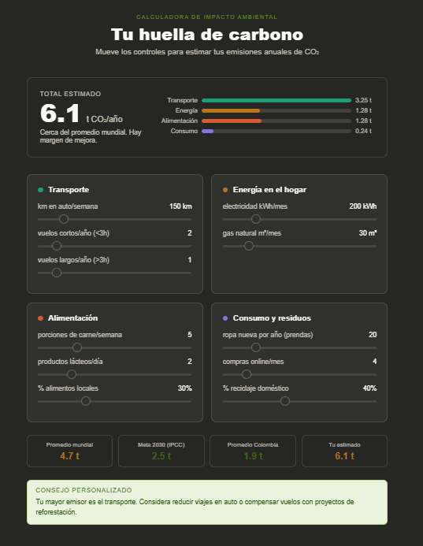
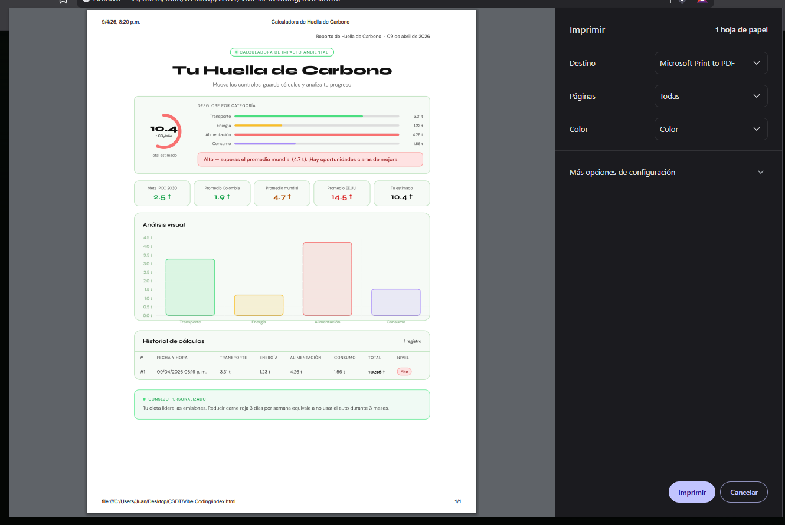
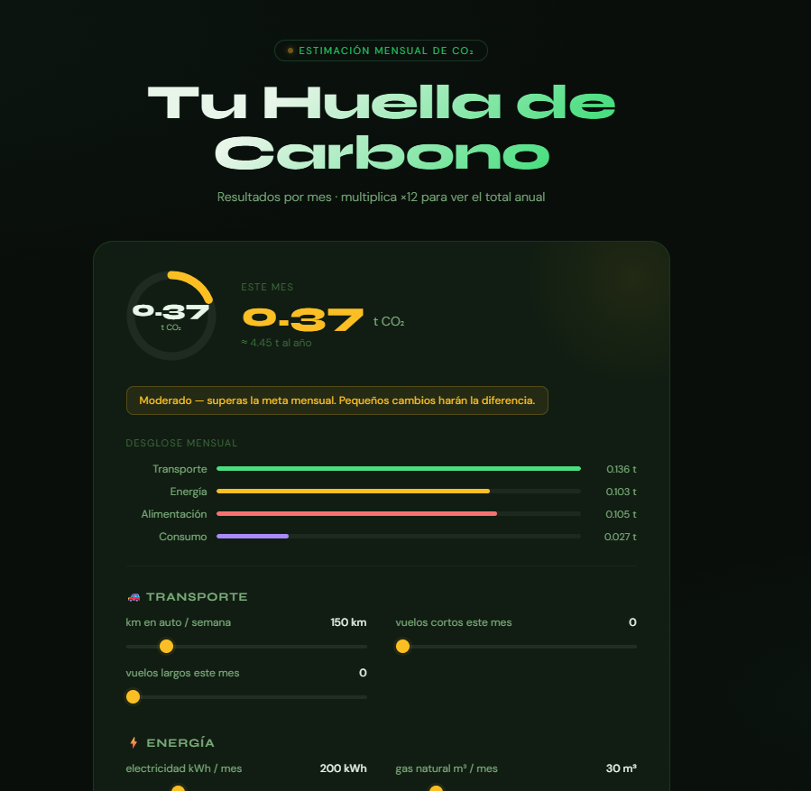
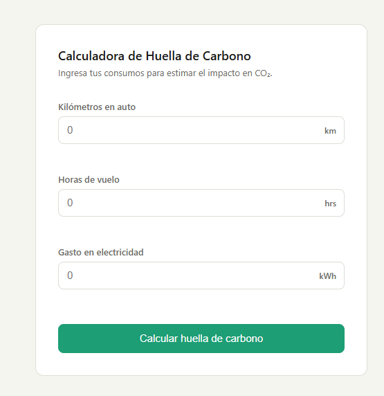
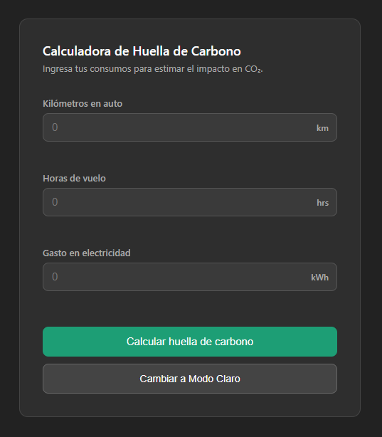

# Vibe Coding

1. Lo primero que paso fue que me dio la pagina pero sin codigo, esto quizas porque estoy usando claude

2. para el segundo prompt considero que lo hizo bastante bien, porque me permitia descargar el pdf y imprimir de una vez

3.  con el tercer prompt lo que hizo fue quitar las graficas y arreglo lo demas que se le pidio, lo unico fue que si se demoro como 1 min pensando

## Análisis de Desastre (Vibe Coding)
1. Inyección de Librerías

Sí hubo indicios claros de inyección automática por parte de la IA.
* Se integró Chart.js para gráficos sin una solicitud explícita inicial.
* También se usaron enfoques tipo exportación (simulando PDF) que normalmente vienen acompañados de librerías como html2pdf, aunque claude dijo que mejor iba a usar window.print().
    "La descarga del PDF la haré directamente desde el navegador con window.print() y CSS de impresión — es mucho más limpio que cualquier librería JS. Ahora creo el archivo completo:"

2. Pérdida de Contexto

No ocurrió directamente, pero el código está en una zona frágil donde un cambio pequeño rompe varias cosas.

3. Alucinaciones de Arquitectura

Sí, este es el problema más evidente.

El código terminó siendo:
* Un solo archivo gigante (HTML + CSS + JS mezclados)
* Sin separación de responsabilidades
* Con múltiples funciones interdependientes

Ejemplo claro:
* UI, lógica, estado y gráficos están todos mezclados
* No hay módulos ni estructura tipo:
    * services
    * components
    * utils

Pero Funciona bien y es visualmente sólido, solo que no está listo para crecer ni mantenerse fácilmente.

# SPEC

1. Este fue como me dio el digo con el primer Promt

2. aca ya añadio el botonb que se le pidio

Crecimiento modular e incremental
* La lógica original (validación + cálculo) no se tocó
* Solo se añadió una nueva funcionalidad (modo oscuro)

El cambio fue:
* Aislado en CSS (.dark-mode)
* Aislado en JS 
* Sin modificar funciones existentes 

Resultado:
El componente crece por capas, no reescribiendo todo.

## ¿Por qué dar el “Spec” evita el Token Sprawl?

Dar un spec técnico claro evita que la IA “invente cosas”.

Sin spec

La IA:
* Agrega librerías (gráficos, PDF, etc.)
* Cambia arquitectura
* Mezcla responsabilidades

Esto genera:
* Más código innecesario
* Más tokens usados
* Más riesgo de errores

Con spec
* Rol → Frontend Senior
* Restricciones → sin frameworks, un solo archivo
* Alcance → “no añadas nada más”
* Cambio puntual → “solo agrega modo oscuro con clase”

Entonces la IA:
* No tiene que adivinar
* No sobrepiensa
* No rehace lo anterior

Dar un spec técnico claro reduce el Token Sprawl porque limita el espacio de decisión de la IA, evitando que agregue funcionalidades, librerías o cambios arquitectónicos no solicitados. Esto permite que el sistema crezca de forma modular e incremental, manteniendo el comportamiento existente y reduciendo el costo en tokens y la complejidad del código.

# La IA también es Inspectora

con este ultimo promt lo que hizo fue ver donde habia bugs y sin pedirselo me dio el codigo ya corregido, adjunto el mensaje que me envio y el codigo corregido se encuentra en indexSpecFix.html

"
Auditoría QA + UX — Hallazgos
Encontré 4 bugs / problemas reales antes de tocar una sola línea:

🐛 Bug 1 — input[type="number"] acepta e, +, - silenciosamente
Severidad: Alta. Los navegadores permiten escribir 1e5, -10 o +3 en un <input type="number">. El .value devuelve cadena vacía para e solo, pero 1e5 pasa isNaN() como válido y produce 50000 kg. Un valor negativo como -5 también pasa y da resultado negativo, que carece de sentido físico.
Corrección: añadir min="0" ya estaba (bien), pero falta bloquear e, +, - en keydown y validar >= 0 en JS.

🐛 Bug 2 — isNaN(Number('')) devuelve false
Severidad: Media. Number('') === 0, por lo que isNaN(Number('')) es false. La guardia actual valor === '' lo cubre, pero es una trampa semántica frágil: si alguien cambia el trim o el orden, la validación se rompe silenciosamente. La forma robusta es input.validity.valid o comparar directamente con input.valueAsNumber.
Corrección: reemplazar la condición por isNaN(input.valueAsNumber) || input.valueAsNumber < 0.

♿ Bug 3 — Los .error-msg no están enlazados a su input (accesibilidad)
Severidad: Media. Un lector de pantalla anuncia el <input> pero no lee el mensaje de error debajo porque no hay ningún aria-describedby que los conecte. El usuario con NVDA o VoiceOver nunca sabe qué salió mal.
Corrección: añadir aria-describedby="err-km" en cada input y role="alert" en cada .error-msg.

🎨 Bug 4 — Contraste insuficiente en .subtitle y label (WCAG AA)
Severidad: Media. #6b6b66 sobre #ffffff da ratio 4.4:1 — justo por debajo del mínimo WCAG AA para texto pequeño (13 px necesita 4.5:1). En modo oscuro #aaa sobre #2e2e2e da 3.9:1, también insuficiente.
Corrección: subir a #5a5a55 en claro (4.6:1 ✓) y a #bbb en oscuro (5.1:1 ✓).

"

tambien me dijo que fue lo que hizo

"

Bug 1 — Caracteres e, +, - bloqueados en keydown
<input type="number"> es una trampa del DOM: el browser acepta 1e5, +3 o -10 aunque visualmente parezca numérico. Se añadió un listener de keydown que llama preventDefault() para esos cuatro caracteres, y la validación en JS también rechaza cualquier valor < 0 con mensaje específico ("no puede ser negativo").
Bug 2 — Validación reescrita con valueAsNumber
isNaN(Number('')) devuelve false porque Number('') es 0. La condición anterior funcionaba por accidente gracias al chequeo === '' antes. Se reemplazó por input.valueAsNumber, que devuelve NaN nativo cuando el campo está vacío o es inválido — semánticamente correcto y sin ambigüedad.
Bug 3 — Accesibilidad de errores (WCAG 4.1.3)
Cada <input> ahora tiene aria-describedby apuntando a su  de error, y cada span tiene role="alert". Esto hace que VoiceOver y NVDA lean el error automáticamente cuando aparece, sin que el usuario tenga que navegar hasta él.
Bug 4 — Contraste WCAG AA en texto secundario
#6b6b66 sobre blanco daba 4.4:1 (falla en 13 px, necesita 4.5:1). Corregido a #5a5a55 → 4.6:1 ✓. En modo oscuro, #aaa sobre #2e2e2e daba 3.9:1; corregido a #bbb → 5.1:1 ✓.

"

# Actividad Vibe Coding + Spec Driven

En el desarrollo de esta actividad pude analizar dos enfoques: el Vibe Coding y el Spec Driven Development. En el primero, la principal ventaja es la rapidez, ya que la IA permite construir soluciones funcionales en poco tiempo sin necesidad de definir muchos detalles desde el inicio. Sin embargo, esto también trae varios retos, como la tendencia a que el código crezca de forma desordenada, se agreguen librerías o funcionalidades innecesarias y se pierda el control de la arquitectura, generando lo que se conoce como “sopa de código”.

Por otro lado, el Spec Driven Development mostró ventajas importantes como un mayor control sobre el resultado, mejor organización del código y un crecimiento más modular e incremental. Al definir claramente el rol, las restricciones y el alcance desde el inicio, se evita que la IA asuma cosas o agregue complejidad innecesaria, lo que también reduce el gasto de tokens y facilita el mantenimiento del código. Algo tambien que me percate fue que con Vibe Coding se demoro bastante caso contrario que con Spec Driven y considero yo que fue porque al especificarle lo que debia hacer se enfoca solo en eso y no en añadir cosas innecesarias

En conclusión, mientras el Vibe Coding es útil para prototipos "rápidos", el Spec Driven Development resulta más adecuado para proyectos donde se busca calidad, escalabilidad y control del desarrollo.

## Autor

Juan David Rodriguez Rodriguez 