# Vibe Coding y Spec-Driven Development Jesus Jauregui

**Curso:** Calidad de Software y Gestión de Deuda Técnica  
**Proyecto:** Customer Management System  
**Fecha:** 2026-04-10

---

## 1. Propósito de la actividad

El objetivo de esta actividad es analizar por qué el enfoque de **Vibe Coding** resulta riesgoso cuando se trabaja con IA generativa y cómo el enfoque de **Spec-Driven Development** reduce ambigüedad, retrabajo y deuda técnica. El caso de estudio propuesto es un componente frontend llamado **Calculadora Ágil de Huella de Carbono**, implementable solo con **HTML, CSS y JavaScript**, sin backend ni base de datos.

---

## 2. Fase 1: Vibe Coding

### Prompt utilizado

> "Hazme una página web bonita para una calculadora de huella de carbono. Que calcule cosas y se vea moderna."

### Resultado observado

La IA generó una página visualmente atractiva, con buen uso de color, tarjetas, responsive básico y una interacción inmediata. A primera vista, el resultado transmite la sensación de que “ya está resuelto”. Ese es precisamente el riesgo pedagógico del ejercicio: la interfaz luce convincente antes de validar si el componente realmente cumple una necesidad bien definida.

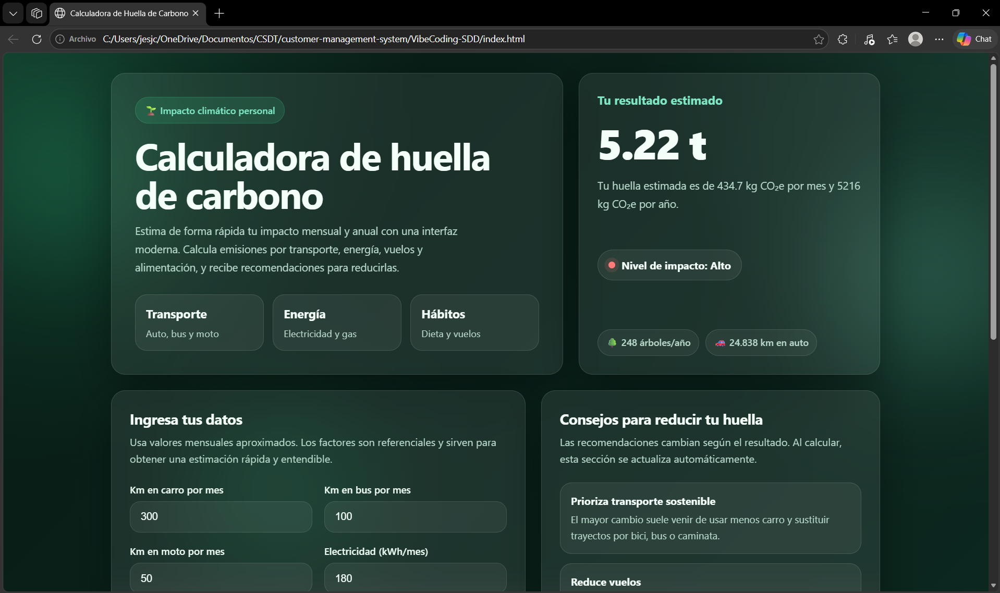

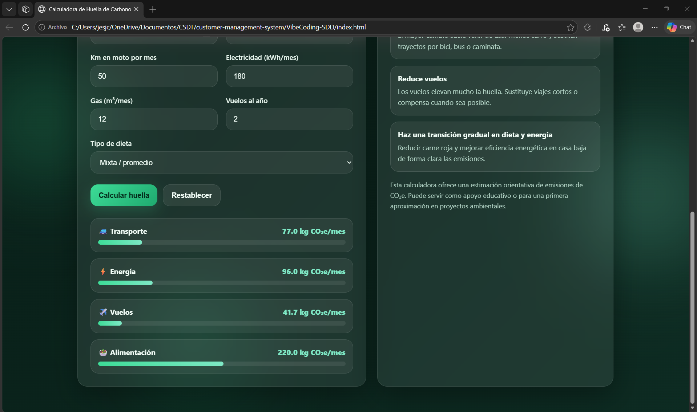

---

## 3. Fase 2: Prueba del primer resultado

### Qué ocurrió al abrir el archivo

El primer resultado realmente produce la sensación de que la IA “resolvió” el problema: la interfaz es moderna, responde bien visualmente y calcula valores sin errores visibles inmediatos. Ese efecto es engañoso porque el éxito visual oculta la ausencia de una especificación técnica.

### Lo que sí funcionaba

- diseño atractivo y convincente;
- formulario utilizable;
- cálculo inmediato de resultados;
- desglose visual por categorías;
- experiencia aceptable en escritorio y móvil.

### Lo que ya mostraba riesgo técnico

- la IA amplió el alcance sin autorización, agregando categorías como vuelos, gas y dieta;
- los factores de emisión quedaron hardcodeados sin fuente ni justificación;
- las entradas inválidas o negativas se transforman silenciosamente en `0`;
- HTML, CSS y JavaScript quedaron mezclados en un solo archivo;
- el resultado inicial depende de supuestos tomados por la IA y no por una especificación formal.

### Lectura de calidad

El primer archivo parecía “correcto”, pero ya tenía deuda técnica temprana: reglas de negocio inventadas, validación opaca y poca trazabilidad. Ahí empieza el efecto mariposa: un prompt vago crea una base frágil para futuros cambios.

---

## 4. Fase 3: El giro inesperado y el efecto mariposa

### Prompt adicional utilizado (Tabla, gráfica y PDF)

> "Ahora haz que los cálculos se guarden en una tabla abajo, añade una gráfica interactiva súper profesional y haz que los colores dependan del resultado. Ah, y que se pueda descargar como PDF profesional."

### Qué cambió realmente

Este cambio parece pequeño desde lenguaje natural, pero técnicamente no lo es. La IA no solo “añadió una tabla” o “pintó colores”; convirtió la calculadora en una mini aplicación frontend con nuevos subsistemas:

- historial persistente;
- visualización avanzada;
- cambio dinámico de tema;
- exportación a PDF;
- integración con librerías externas;
- mayor manejo de estado en cliente.

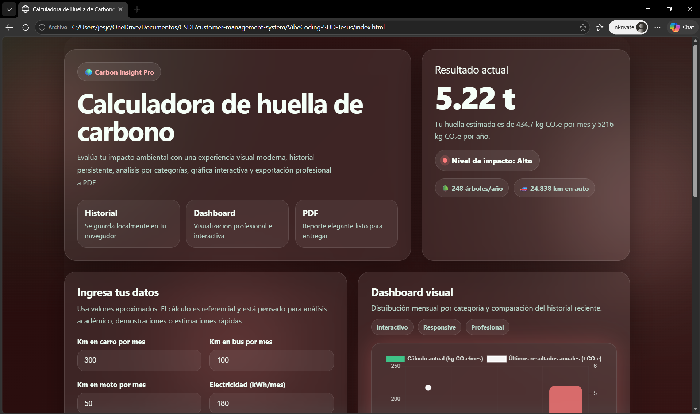

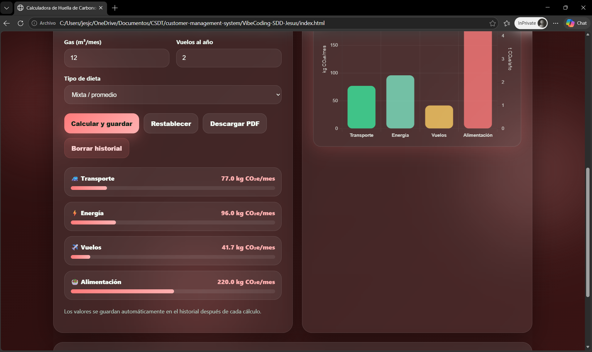

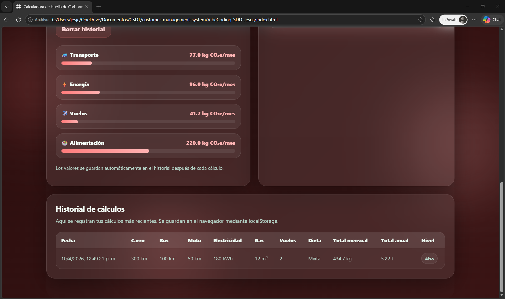

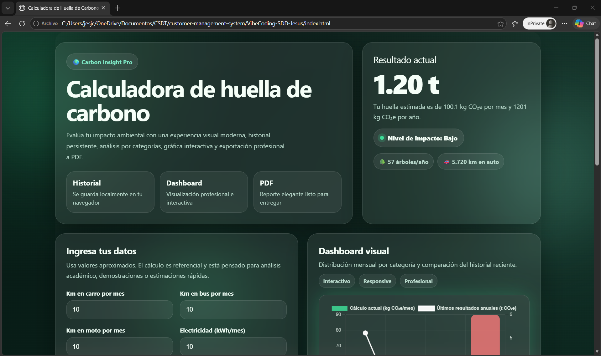

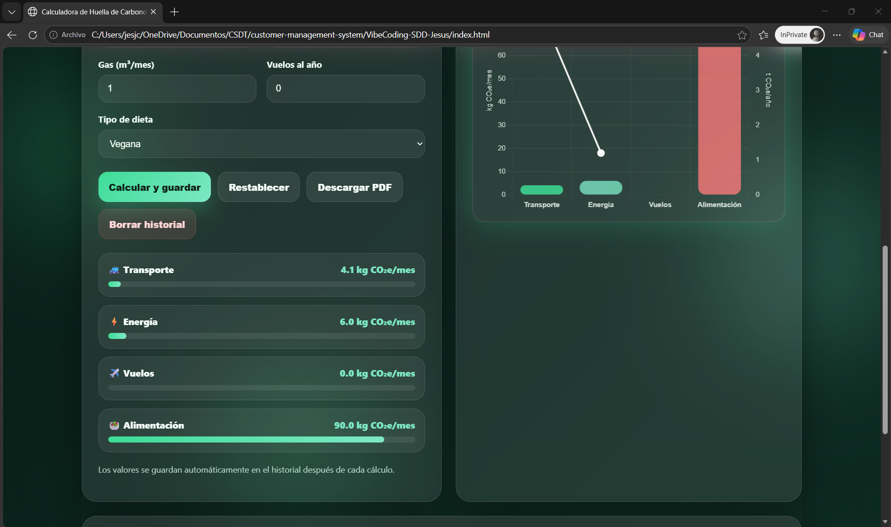

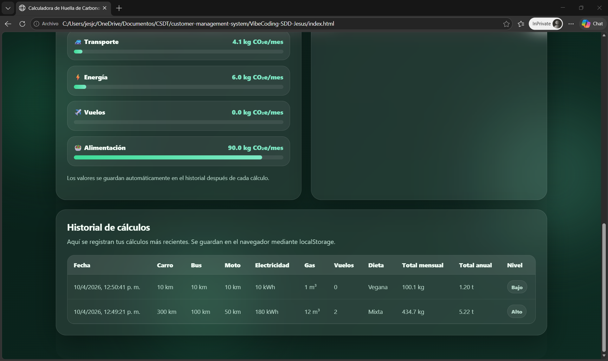

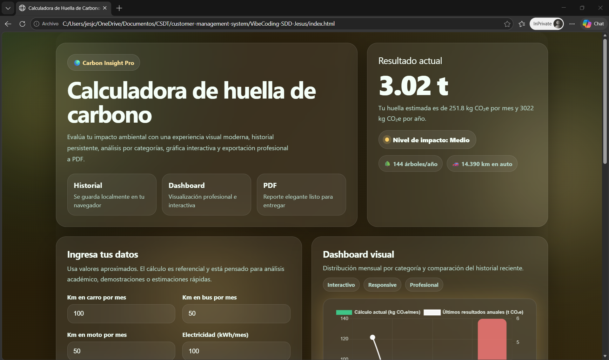

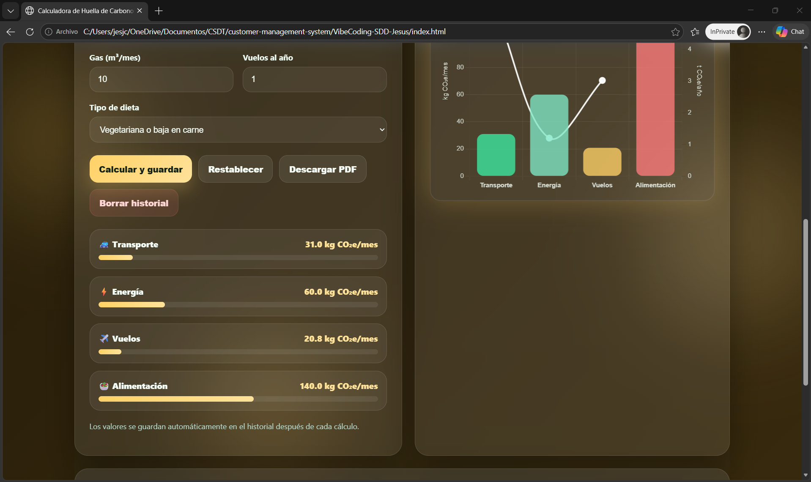

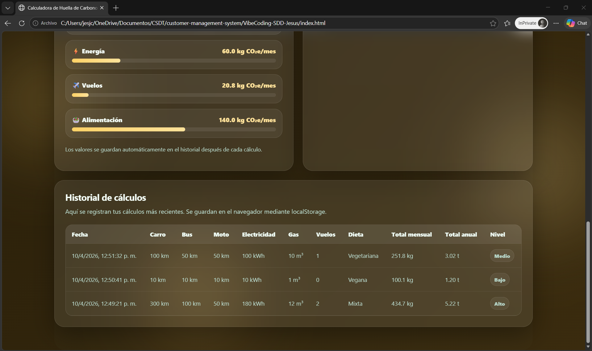

### Evidencia del salto arquitectónico

- la solución incorporó persistencia en navegador con `localStorage`;
- aparecieron dependencias externas para gráfica y PDF;
- la función principal dejó de solo calcular y pasó a construir objetos completos de historial;
- el tema visual quedó acoplado al nivel de impacto;
- la exportación “profesional” terminó resolviéndose como captura visual del DOM.

---

## 5. Fase 4: El colapso y el Frankenstein Code

### Prompt adicional utilizado (Minimalismo y cambio a mensual)

> "No me gusta el gráfico, quítalo y haz que sea minimalista en una sola tarjeta, pero mantén la descarga de PDF. Además, ahora los cálculos deben ser mensuales estimamos por 12 meses, no por año. Arréglalo rápido."

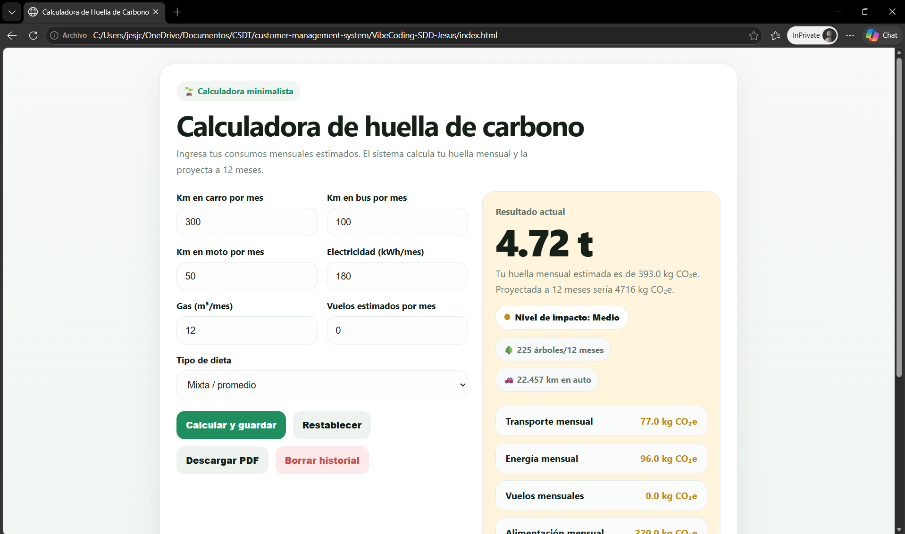

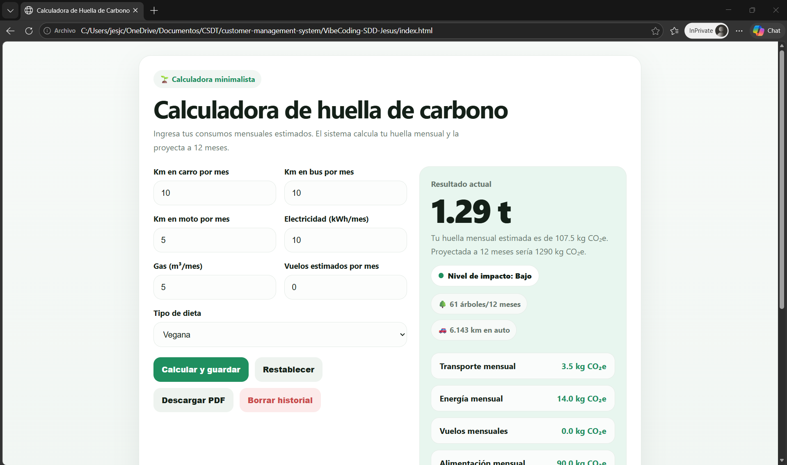

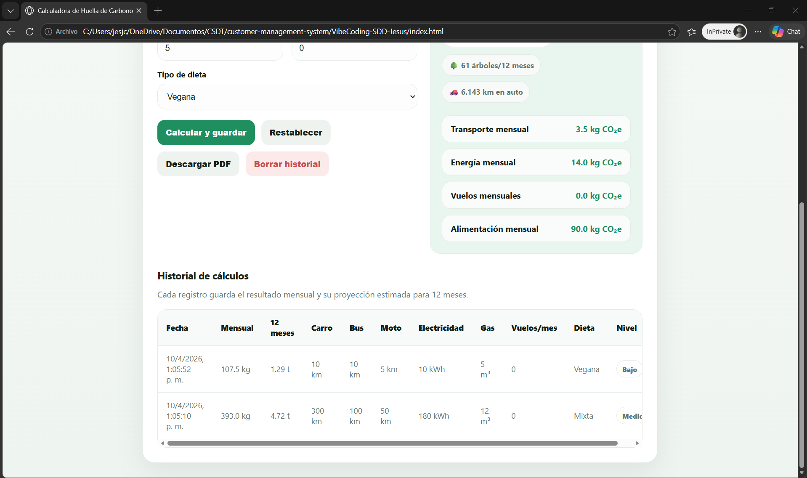

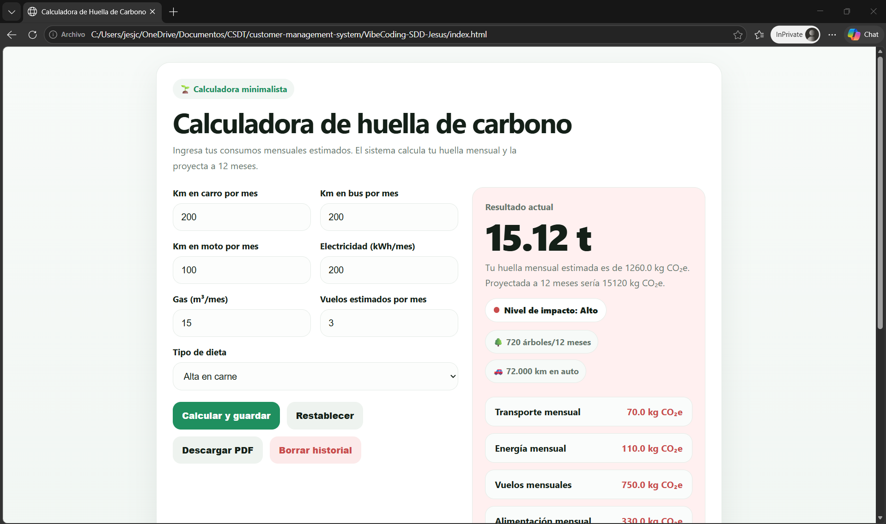

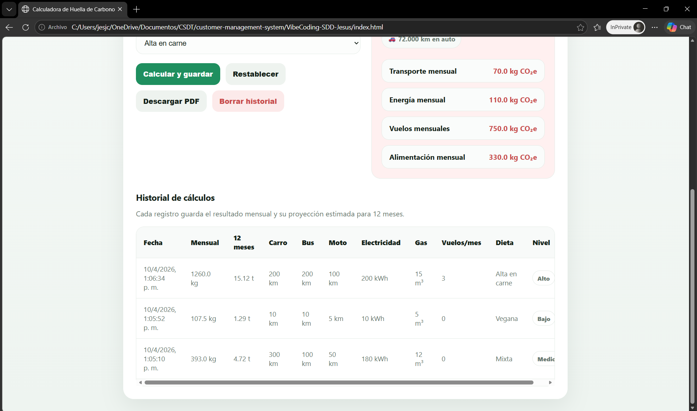

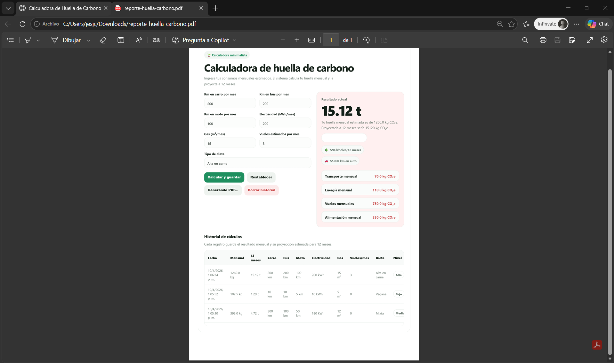

### Qué ocurrió

La IA sí eliminó el gráfico y simplificó la vista, pero el resultado no es una refactorización limpia. Es una reconfiguración rápida sobre una base ya improvisada. El archivo sigue cargando lógica, presentación, persistencia y exportación en un único bloque, y además conserva rastros conceptuales de versiones anteriores.

### Evidencia del colapso

#### 5.1 Inyección de librerías sin diseño previo

Aunque el gráfico fue eliminado, el proyecto sigue dependiendo de librerías externas para generar el PDF:

- `jsPDF`;
- `html2canvas`.

Eso confirma la lección del laboratorio: cuando no existe especificación, cada nuevo pedido va dejando dependencias y decisiones de integración que no nacen de una arquitectura pensada, sino de parches sucesivos.

#### 5.2 Pérdida parcial de contexto

El gráfico desapareció, pero no hubo una limpieza conceptual completa del código. Por ejemplo:

- el resultado principal sigue almacenándose en una variable llamada `annualResult`, aunque ya no representa un cálculo anual sino una proyección a 12 meses;
- el texto cambió a “mensual proyectado a 12 meses”, pero parte del modelo mental anterior sigue presente en nombres y estructura;
- la persistencia y el PDF permanecen aunque la interfaz se haya reducido a una tarjeta minimalista.

Esto es una señal clara de refactorización superficial: cambia la piel, pero no se reorganiza de verdad la arquitectura.

#### 5.3 Sopa de responsabilidades

El archivo `index.html` sigue mezclando:

- HTML;
- CSS;
- lógica de cálculo;
- lógica de proyección;
- render de resultados;
- persistencia en `localStorage`;
- generación de PDF;
- manejo del historial;
- reseteo del estado visual.

Eso es justamente lo que se entiende por **Frankenstein Code**: piezas cosidas para que “funcionen” rápido, pero sin una estructura clara de módulos o capas.

#### 5.4 Cambio funcional apresurado

El requisito cambió de “año” a “mensual proyectado a 12 meses”. La IA hizo el ajuste, pero de forma apresurada:

- cambió el campo de vuelos de anual a mensual;
- cambió el texto visible;
- cambió la fórmula de proyección.

Sin embargo, el sistema no fue rediseñado desde un modelo consistente. Quedó una mezcla de conceptos entre mensual, anual y proyección a 12 meses que solo se entiende leyendo todo el archivo.

### Análisis del desastre solicitado

#### Inyección de librerías

Sí. En fases previas la IA añadió librerías externas para cubrir nuevas exigencias sin consultar si eran aceptables para el proyecto. Aunque Chart.js ya no está, quedaron `jsPDF` y `html2canvas`, lo que evidencia una arquitectura guiada por reacción y no por diseño.

#### Pérdida de contexto

Sí, parcialmente. Al quitar el gráfico, la IA también reconfiguró el flujo completo hacia una “tarjeta minimalista”, pero no limpió del todo las decisiones previas. Permanecen el historial, la exportación por captura visual y nombres heredados que ya no representan bien el comportamiento actual.

#### Alucinaciones de arquitectura

Sí. La aplicación resuelve requerimientos mezclando persistencia, proyección, vista, reporte y estado en un único archivo. No hay separación clara entre:

- datos;
- lógica de negocio;
- renderizado;
- infraestructura de exportación.

### Lección principal

Sin una especificación previa, cada nuevo requerimiento es efectivamente una tirada de dados. A veces la IA produce algo que luce mejor; otras veces deja un sistema más frágil, más acoplado y más difícil de entender. El problema no es solo el código generado en una iteración, sino la incapacidad de sostener cambios sucesivos sin degradar la estructura.

---

## 6. Fase 2: Spec-Driven Development

### Mega-prompt utilizado

#### Historia de Usuario 1

- rol definido: `Ingeniero Frontend Senior`;
- contexto tecnológico explícito: SPA sin React, sin Vue y sin CDNs de estilos;
- restricción arquitectónica explícita: todo en un único `index.html`;
- restricción de implementación: HTML semántico, CSS puro en `<style>` y JavaScript puro en `<script>`;
- comportamiento esperado claramente delimitado:
  - 3 campos numéricos;
  - 1 botón para calcular;
  - suma de los tres valores;
  - multiplicación por `0.5`;
  - mostrar `Total de Huella de Carbono en KG`;
  - validar campos vacíos;
  - no añadir nada más.

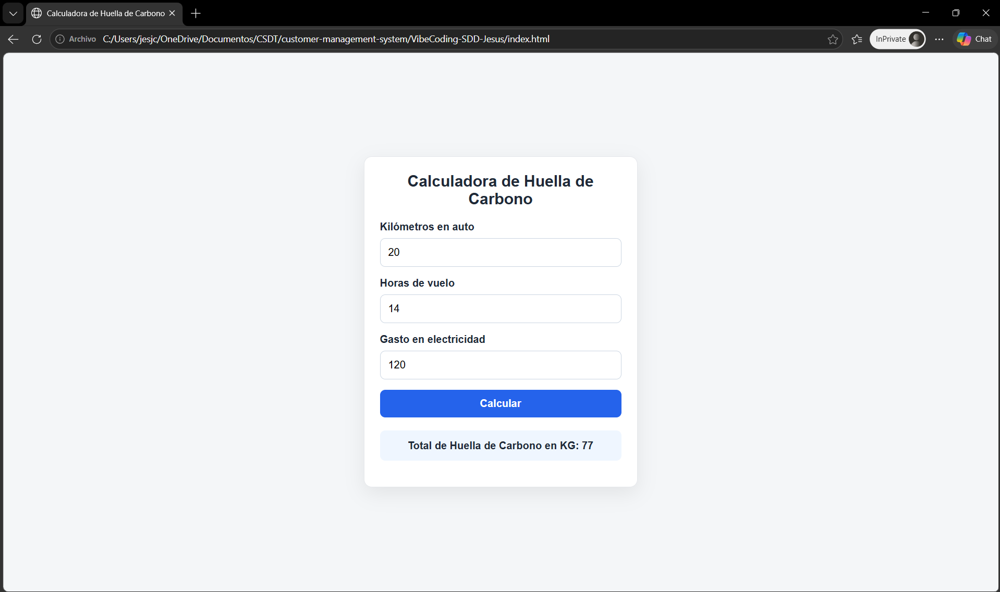

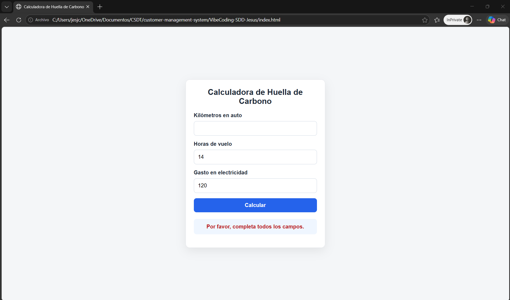

#### Historia de Usuario 2

- agregar un botón `Cambiar a Modo Oscuro`;
- ese botón debe agregar únicamente la clase `.dark-mode` al `body`;
- usar colores oscuros estándar `#222` y `#fff`.

### Resultado observado en el archivo

El `index.html` actual sí responde de forma bastante fiel a la especificación:

- contiene exactamente tres campos numéricos: kilómetros en auto, horas de vuelo y gasto en electricidad;
- valida que ningún campo esté vacío antes del cálculo;
- realiza la operación `(valor1 + valor2 + valor3) * 0.5`;
- muestra el resultado en pantalla con JavaScript;
- incorpora el botón de modo oscuro de forma incremental;
- no agrega librerías externas ni complejidad innecesaria.

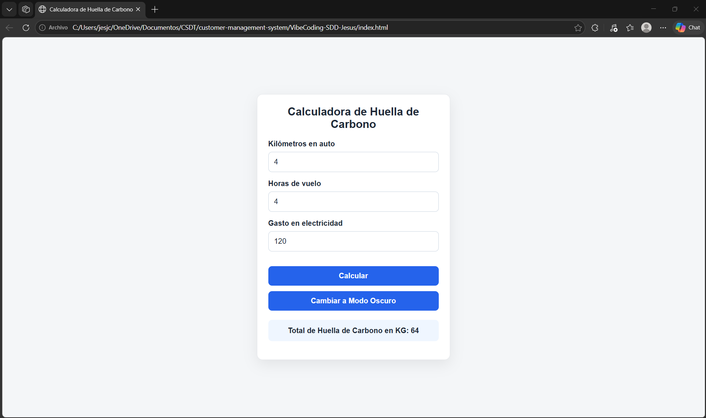

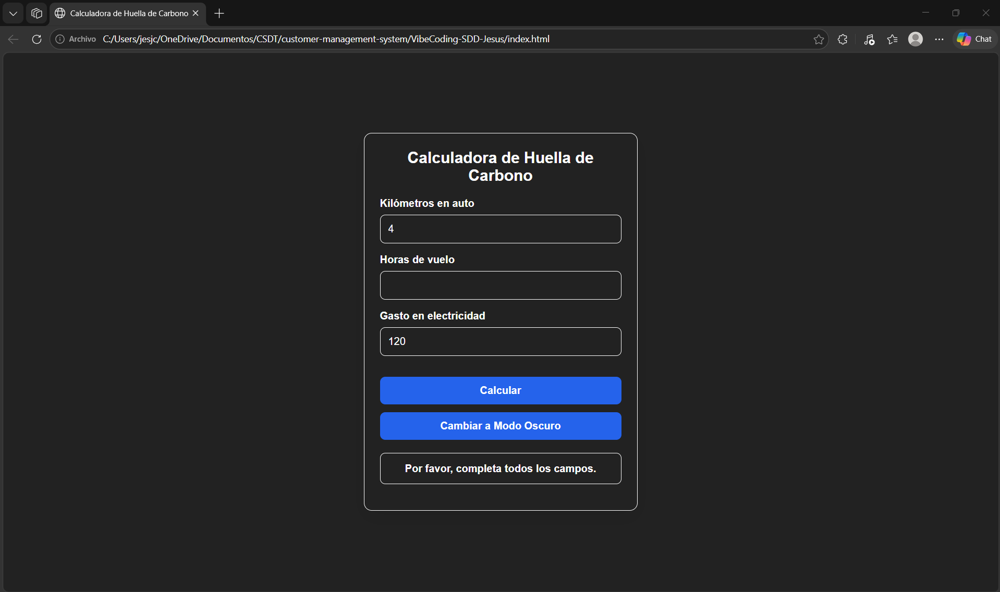

### Evidencia de control técnico

#### 6.1 Arquitectura contenida

El archivo conserva una estructura pequeña y entendible:

- HTML limitado al formulario y al resultado;
- CSS breve y localizado;
- JavaScript corto, con dos eventos claros:
  - cálculo;
  - activación de modo oscuro.

No hay persistencia, no hay gráficas, no hay PDF, no hay dependencias externas y no hay decisiones ocultas de producto.

#### 6.2 Crecimiento incremental sin ruptura

La segunda historia de usuario no obligó a rehacer la lógica de cálculo. Solo añadió:

- una clase `.dark-mode` en CSS;
- un botón adicional en la interfaz;
- un `addEventListener` específico para aplicar la clase al `body`.

Eso es exactamente lo que se espera en un desarrollo guiado por especificación: cambio pequeño, impacto pequeño y comportamiento existente intacto.

#### 6.3 Trazabilidad entre requerimiento y código

Cada parte del código puede mapearse con claridad a una instrucción del prompt:

- los campos existen porque fueron pedidos;
- el cálculo implementa la fórmula pedida;
- la validación responde a la restricción de no aceptar vacíos;
- el modo oscuro usa `#222` y `#fff`, tal como se indicó;
- el botón de modo oscuro agrega la clase `.dark-mode` al `body`, sin introducir otras mecánicas.

Aquí no hay alucinación de arquitectura; hay ejecución de especificación.

### Comparación: control vs caos

En el enfoque Vibe Coding, cada prompt nuevo disparó decisiones implícitas y complejidad accidental. En esta fase ocurrió lo contrario:

- el alcance fue pequeño y explícito;
- el crecimiento fue modular;
- el cambio nuevo no destruyó lo anterior;
- la IA no necesitó “inventar” subsistemas;
- el archivo se mantuvo legible.

### Reflexión de equipo

#### ¿Por qué dar el spec antes evita token sprawl?

Porque la IA no necesita gastar contexto imaginando:

- qué campos usar;
- qué fórmula aplicar;
- qué tecnología incorporar;
- qué estilo elegir;
- qué comportamiento extra agregar.

El spec limita el espacio de decisión. En vez de consumir tokens explorando posibilidades arbitrarias, la IA los usa implementando instrucciones concretas.

#### ¿Por qué el componente crece de forma modular?

Porque cada historia de usuario agrega una sola responsabilidad nueva sobre una base ya definida. No se están mezclando cambios visuales, de datos, de persistencia y de exportación al mismo tiempo.

### Lección de la fase

La diferencia central es esta: en Vibe Coding el sistema evoluciona por improvisación; en Spec-Driven Development evoluciona por contrato. Cuando el diseño técnico se expresa primero, el copiloto no adivina, ejecuta.

Por eso, en este enfoque, la especificación funciona como una forma moderna de código de alto nivel: define intención, límites, arquitectura y criterios de cambio antes de implementar.

---

## 7. Fase 3: Quality Gate

### Prompt de auditoría utilizado

> "Cambia de rol. Ahora eres un experto en Aseguramiento de Calidad (QA) y Experiencia de Usuario (UX). Analiza mi código anterior. Encuentra posibles bugs si el usuario ingresa letras en vez de números, o si hay problemas de accesibilidad (contraste). Dime qué corregirías y refactoriza solo la parte afectada."

### Hallazgos detectados

La revisión identificó dos problemas concretos sobre el componente guiado por especificación:

- la validación original solo comprobaba campos vacíos, pero no confirmaba de forma explícita que las entradas fueran números válidos;
- el estado de error era visualmente débil y, en modo oscuro, podía tener contraste insuficiente para una buena experiencia de usuario.

### Refactor aplicado

Se corrigieron únicamente las partes afectadas del archivo:

- validación con `Number(...)` y `Number.isFinite(...)`;
- uso de `aria-invalid="true"` en entradas inválidas;
- mejora del estilo visual de `.error` con color, fondo y borde;
- variante de error específica para modo oscuro;
- adición de `role="status"` en el contenedor del resultado para mejorar accesibilidad básica.

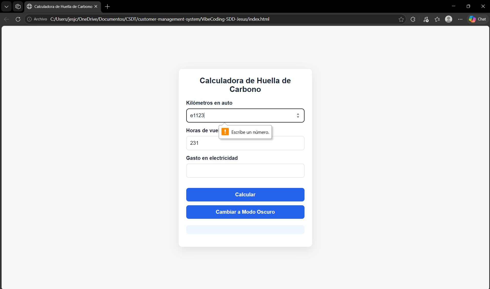

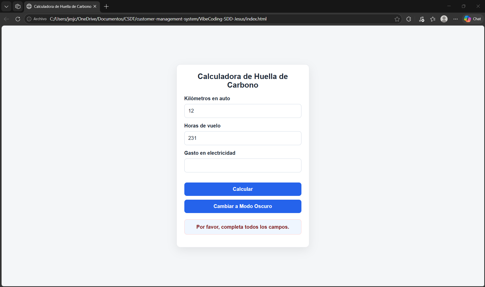

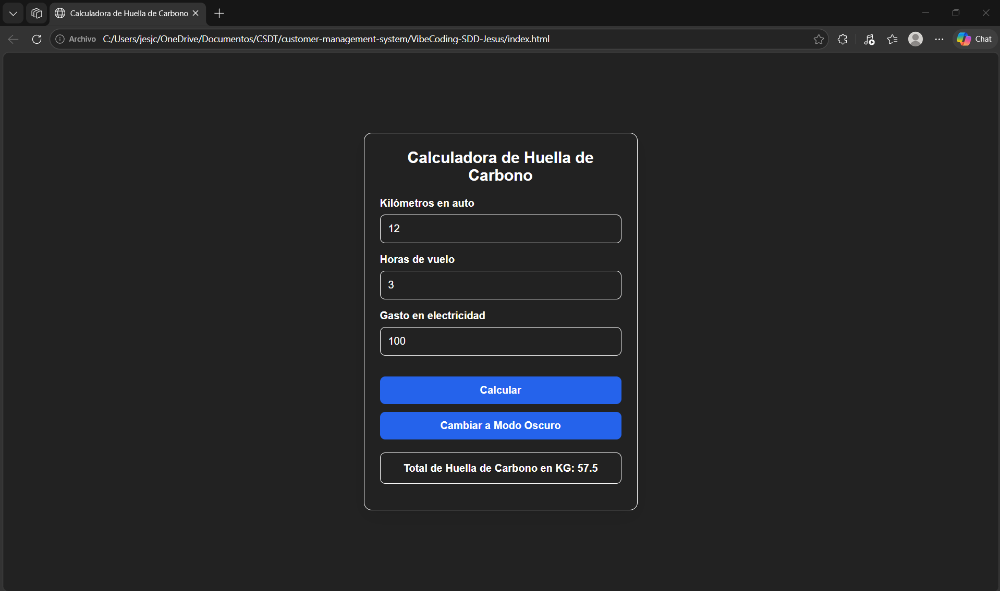

### Resultado del Quality Gate

La mejora fue localizada y no obligó a rehacer el componente. Eso es importante: al existir una base pequeña y controlada, la auditoría QA/UX no encontró una arquitectura caótica sino defectos concretos y corregibles.

### Qué enseña esta fase

El valor de esta etapa no es solo detectar bugs, sino demostrar que la IA también puede funcionar como inspectora dentro del ciclo AIDLC. Primero ayuda a implementar bajo restricciones; después ayuda a auditar calidad antes de considerar el componente como listo.

La diferencia frente al Vibe Coding es clara:

- en una base improvisada, la auditoría suele descubrir problemas estructurales;
- en una base guiada por spec, la auditoría encuentra mejoras puntuales y la refactorización se mantiene acotada.

---

## 8. Conclusión final

El laboratorio completo demuestra dos formas opuestas de trabajar con IA:

- con prompts vagos, la IA produce resultados vistosos pero inestables, difíciles de sostener y cada vez más acoplados;
- con especificaciones claras, la IA produce componentes pequeños, trazables, controlables y fáciles de extender;
- con un Quality Gate final, la IA puede además actuar como auditora y ayudar a cerrar brechas de QA y UX sin romper el diseño inicial.

La conclusión no es que la IA sea el problema. El problema es delegarle decisiones de arquitectura sin restricciones. Cuando el equipo define primero el diseño técnico y luego aplica verificación, la IA deja de improvisar y pasa a ser una herramienta realmente útil para construir, revisar y endurecer software.
